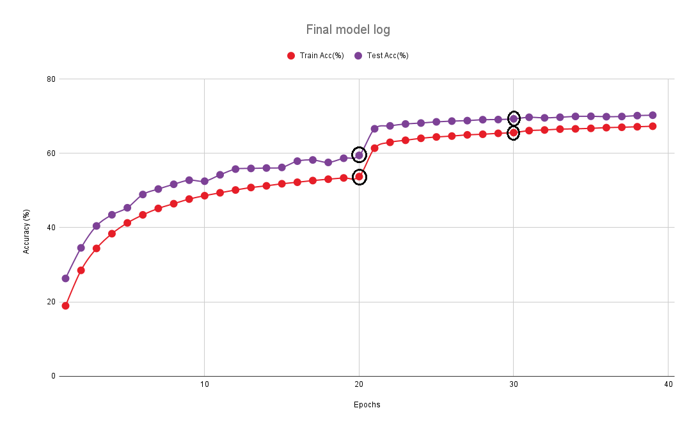
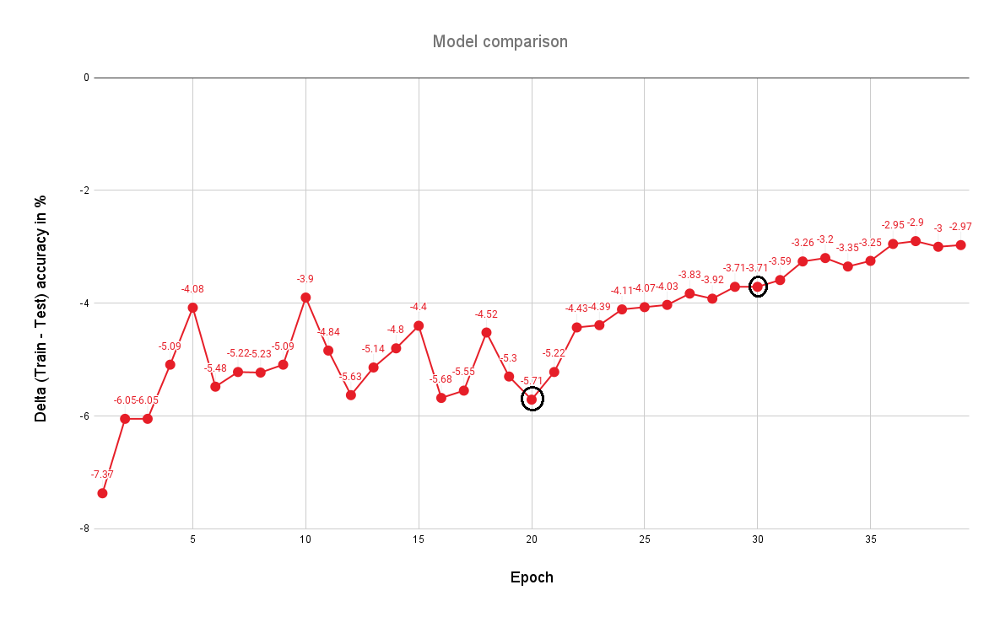

# ImageNet 1k Image Classification with ResNet 50

This project is an implementation of the ResNet 50 model written and trained from scratch on the ImageNet 1k dataset. The model was run on an AWS EC2 instance (g6.4xLarge). The target for the project was to have the model reach at least 70% top-1 test accuracy.

## Model Architecture

The ResNet 50 model implemented in this project is constructed from scratch using PyTorch. The architecture is based on the original ResNet paper, featuring a series of bottleneck blocks and skip connections that allow for deep network training without the vanishing gradient problem. 

### Key Components:

- **Bottleneck Block**: Each block consists of three convolutional layers. The first layer reduces the dimensionality, the second layer performs the main computation, and the third layer expands the dimensionality back. This design allows the network to learn complex features while maintaining computational efficiency.

- **Initial Convolution Layer**: The model begins with a 7x7 convolutional layer with a stride of 2, followed by batch normalization and a ReLU activation function. This is followed by a 3x3 max pooling layer to reduce the spatial dimensions.

- **Layer Stacking**: The network is composed of four main layers, each containing a series of bottleneck blocks and skip connections. The number of blocks in each layer is [3, 4, 6, 3], respectively. The first layer maintains the input dimensions, while subsequent layers downsample the spatial dimensions using a stride of 2 in the first block of each layer.

- **Adaptive Average Pooling**: After the final layer, an adaptive average pooling layer reduces the feature map to a 1x1 spatial dimension, preparing it for the fully connected layer.

- **Fully Connected Layer**: The final layer is a fully connected layer that outputs the class probabilities for the 1000 classes of the ImageNet 1k dataset.

This implementation leverages PyTorch's `nn.Module` to define the model structure, ensuring flexibility and ease of use. The model is designed to be trained on large-scale datasets like ImageNet, with the capability to achieve high accuracy through its deep architecture and efficient bottleneck design.

## Data Augmentations

The augmentations are inspired by the original ResNet paper and implemented using the albumentations library. The augmentations include random resized cropping, horizontal flipping, and color jittering, followed by normalization. These transformations help the model learn invariant features and improve performance on unseen data.

### Augmentations and Hyperparameters

1. **Random Resized Crop:**
   - Height: 224
   - Width: 224
   - Scale: (0.08, 1.0)
   - Aspect Ratio: (3/4, 4/3)
   - Probability: 1.0

2. **Horizontal Flip:**
   - Probability: 0.5

3. **Color Jitter:**
   - Brightness: 0.2
   - Contrast: 0.2
   - Saturation: 0.2
   - Hue: 0.05
   - Probability: 0.5

4. **Normalization:**
   - Mean: (0.485, 0.456, 0.406)
   - Standard Deviation: (0.229, 0.224, 0.225)

These augmentations are applied only to the training dataset, while the test dataset undergoes resizing and normalization to ensure consistent evaluation metrics.

## Model Hyperparameters

The training of the ResNet 50 model involves several key hyperparameters that are crucial for optimizing performance and ensuring efficient learning. These hyperparameters are defined and utilized across various scripts in the project.

### Loss Function

- **Cross-Entropy Loss**: The model uses the cross-entropy loss function, which is suitable for multi-class classification problems like ImageNet. This loss function measures the performance of the model by comparing the predicted class probabilities with the true class labels.

### Optimizer

- **Stochastic Gradient Descent (SGD)**: The optimizer used is SGD, which is a popular choice for training deep learning models. It is configured with the following parameters:
  - Learning Rate (`lr`): 0.001
  - Momentum: 0.9
  - Weight Decay: 0.0001

These parameters help in controlling the update steps during training, with momentum aiding in accelerating the optimizer in the relevant direction and dampening oscillations.

### Learning Rate Scheduler

- **One-Cycle Learning Rate Scheduler**: The One-Cycle LR scheduler is employed to adjust the learning rate dynamically during training. It helps in achieving better convergence by initially increasing the learning rate and then gradually decreasing it. The maximum learning rate (`max_lr`) is set to 0.01, and the scheduler is configured to run for the entire training duration.

These hyperparameters are defined in the `main.py` script, where the model, optimizer, and scheduler are initialized and used during the training loop.

## Model Results

The model after 39 epochs of training achieved the following accuracies - 

**Top-1 Accuracy**

   - Train accuracy =  67.30%

   - Test accuracy  =  70.27%

**Top-5 Accuracy**

   - Train accuracy =  86.46%

   - Test accuracy  =  89.94%

The test accuracy here is measured on the validation dataset of ImageNet 1k, as the labels for the actual test dataset of ImageNet 1k are not publicly available. 

### Experimentation 

We used checkpoints throughout the training, saving the best performing model from every experiment. The next experiment would start with this checkpoint. The final model is hence a culmination of all the experiments. 

Two key checkpoints were at 20 epochs and at 30 epochs, and the effects of the changes can be distinctly seen in the model graphs. We noticed after 20 epochs that the model was underfitting, while when we had run the model without any augmentations (not shown in these graphs and logs), the model was already overfitting after 5 epochs. We noticed that the model was unable to reduce the underfit, as the delta (train - test accuracy) was not decreasing monotonically but oscillating. We concluded the augmentation was too strong, and hence reduced the jitter augmentation hyperparameters after 20 epochs (brightness, contrast, saturation and hue). We also added the One Cycle LR scheduler at this point. Both these changes had a favorable impact on model performance, as there was a sharp jump in training and test accuracies at this point (likely due to smaller learning rate applied at start of One Cycle LR), followed by a steadily decreasing delta (likely due to reduced jitter). Following this, at 30 epochs, we reduced the jitter augmentation further (probability hyperparameter). At 38 epochs, we could hit the target of 70% top-1 test accuracy. 

## Visualizations

Final model log - notice the change in the log at the epochs where models were changed.

 

Delta (train-test) accuracy log - note the model was unable to reduce underfitting until 20 epochs, and how reducing the augmentation after that helped the model to converge. 

## Model Logs

Checkpoint loaded, resuming from epoch 1
Epoch 1 | Loss: 4.1308 | Top-1 Acc: 18.95 | Top-5 Acc: 40.25:
100%|█████████████████████████████████████████████████████████████████████████████████████|
10010/10010 [55:03<00:00,  3.03it/s]
Test Loss: 3.4872, Top-1 Accuracy: 26.32, Top-5 Accuracy: 51.94
Epoch 1 | Train Top-1 Acc: 18.95 | Test Top-1 Acc: 26.32
Checkpoint saved at epoch 1

Epoch 2 | Loss: 3.4660 | Top-1 Acc: 28.50 | Top-5 Acc: 52.89:
100%|█████████████████████████████████████████████████████████████████████████████████████|
10010/10010 [54:59<00:00,  3.03it/s]
Test Loss: 3.0054, Top-1 Accuracy: 34.55, Top-5 Accuracy: 61.18
Epoch 2 | Train Top-1 Acc: 28.50 | Test Top-1 Acc: 34.55
Checkpoint saved at epoch 2

Epoch 3 | Loss: 3.1044 | Top-1 Acc: 34.40 | Top-5 Acc: 59.59:
100%|█████████████████████████████████████████████████████████████████████████████████████|
10010/10010 [55:06<00:00,  3.03it/s]
Test Loss: 2.6458, Top-1 Accuracy: 40.45, Top-5 Accuracy: 67.49
Epoch 3 | Train Top-1 Acc: 34.40 | Test Top-1 Acc: 40.45
Checkpoint saved at epoch 3

Epoch 4 | Loss: 2.8763 | Top-1 Acc: 38.37 | Top-5 Acc: 63.71:
100%|█████████████████████████████████████████████████████████████████████████████████████|
10010/10010 [54:59<00:00,  3.03it/s]
Test Loss: 2.4953, Top-1 Accuracy: 43.46, Top-5 Accuracy: 70.21
Epoch 4 | Train Top-1 Acc: 38.37 | Test Top-1 Acc: 43.46
Checkpoint saved at epoch 4

Epoch 5 | Loss: 2.7141 | Top-1 Acc: 41.27 | Top-5 Acc: 66.46:
100%|█████████████████████████████████████████████████████████████████████████████████████|
10010/10010 [55:07<00:00,  3.03it/s]
Test Loss: 2.3763, Top-1 Accuracy: 45.35, Top-5 Accuracy: 72.20
Epoch 5 | Train Top-1 Acc: 41.27 | Test Top-1 Acc: 45.35
Checkpoint saved at epoch 5

Epoch 6 | Loss: 2.5956 | Top-1 Acc: 43.44 | Top-5 Acc: 68.52:
100%|█████████████████████████████████████████████████████████████████████████████████████|
10010/10010 [55:05<00:00,  3.03it/s]
Test Loss: 2.2087, Top-1 Accuracy: 48.92, Top-5 Accuracy: 74.94
Epoch 6 | Train Top-1 Acc: 43.44 | Test Top-1 Acc: 48.92
Checkpoint saved at epoch 6

Epoch 7 | Loss: 2.5062 | Top-1 Acc: 45.17 | Top-5 Acc: 70.01:
100%|█████████████████████████████████████████████████████████████████████████████████████|
10010/10010 [55:00<00:00,  3.03it/s]
Test Loss: 2.1293, Top-1 Accuracy: 50.39, Top-5 Accuracy: 76.31
Epoch 7 | Train Top-1 Acc: 45.17 | Test Top-1 Acc: 50.39
Checkpoint saved at epoch 7

Epoch 8 | Loss: 2.4347 | Top-1 Acc: 46.44 | Top-5 Acc: 71.23:
100%|█████████████████████████████████████████████████████████████████████████████████████|
10010/10010 [55:08<00:00,  3.03it/s]
Test Loss: 2.0405, Top-1 Accuracy: 51.67, Top-5 Accuracy: 77.95
Epoch 8 | Train Top-1 Acc: 46.44 | Test Top-1 Acc: 51.67
Checkpoint saved at epoch 8

Epoch 9 | Loss: 2.3718 | Top-1 Acc: 47.69 | Top-5 Acc: 72.29:
100%|█████████████████████████████████████████████████████████████████████████████████████|
10010/10010 [55:03<00:00,  3.03it/s]
Test Loss: 1.9893, Top-1 Accuracy: 52.78, Top-5 Accuracy: 78.42
Epoch 9 | Train Top-1 Acc: 47.69 | Test Top-1 Acc: 52.78
Checkpoint saved at epoch 9

Epoch 10 | Loss: 2.3219 | Top-1 Acc: 48.60 | Top-5 Acc: 73.08:
100%|████████████████████████████████████████████████████████████████████████████████████|
10010/10010 [55:15<00:00,  3.02it/s]
Test Loss: 2.0084, Top-1 Accuracy: 52.50, Top-5 Accuracy: 78.19
Epoch 10 | Train Top-1 Acc: 48.60 | Test Top-1 Acc: 52.50
Checkpoint saved at epoch 10

Epoch 11 | Loss: 2.2819 | Top-1 Acc: 49.38 | Top-5 Acc: 73.73:
100%|████████████████████████████████████████████████████████████████████████████████████|
10010/10010 [55:10<00:00,  3.02it/s]
Test Loss: 1.9478, Top-1 Accuracy: 54.22, Top-5 Accuracy: 79.29
Epoch 11 | Train Top-1 Acc: 49.38 | Test Top-1 Acc: 54.22
Checkpoint saved at epoch 11

Epoch 12 | Loss: 2.2439 | Top-1 Acc: 50.13 | Top-5 Acc: 74.37:
100%|████████████████████████████████████████████████████████████████████████████████████|
10010/10010 [55:07<00:00,  3.03it/s]
Test Loss: 1.8487, Top-1 Accuracy: 55.76, Top-5 Accuracy: 80.88
Epoch 12 | Train Top-1 Acc: 50.13 | Test Top-1 Acc: 55.76
Checkpoint saved at epoch 12

Epoch 13 | Loss: 2.2105 | Top-1 Acc: 50.81 | Top-5 Acc: 74.89:
100%|████████████████████████████████████████████████████████████████████████████████████|
10010/10010 [55:04<00:00,  3.03it/s]
Test Loss: 1.8293, Top-1 Accuracy: 55.94, Top-5 Accuracy: 81.07
Epoch 13 | Train Top-1 Acc: 50.81 | Test Top-1 Acc: 55.94
Checkpoint saved at epoch 13

Epoch 14 | Loss: 2.1846 | Top-1 Acc: 51.25 | Top-5 Acc: 75.27:
100%|████████████████████████████████████████████████████████████████████████████████████|
10010/10010 [55:04<00:00,  3.03it/s]
Test Loss: 1.8419, Top-1 Accuracy: 56.05, Top-5 Accuracy: 81.10
Epoch 14 | Train Top-1 Acc: 51.25 | Test Top-1 Acc: 56.05
Checkpoint saved at epoch 14

Epoch 15 | Loss: 2.1587 | Top-1 Acc: 51.81 | Top-5 Acc: 75.66:
100%|████████████████████████████████████████████████████████████████████████████████████|
10010/10010 [55:15<00:00,  3.02it/s]
Test Loss: 1.8308, Top-1 Accuracy: 56.21, Top-5 Accuracy: 81.08
Epoch 15 | Train Top-1 Acc: 51.81 | Test Top-1 Acc: 56.21
Checkpoint saved at epoch 15

Epoch 16 | Loss: 2.1365 | Top-1 Acc: 52.22 | Top-5 Acc: 75.97:
100%|████████████████████████████████████████████████████████████████████████████████████|
10010/10010 [55:05<00:00,  3.03it/s]
Test Loss: 1.7530, Top-1 Accuracy: 57.90, Top-5 Accuracy: 82.15
Epoch 16 | Train Top-1 Acc: 52.22 | Test Top-1 Acc: 57.90
Checkpoint saved at epoch 16

Epoch 17 | Loss: 2.1152 | Top-1 Acc: 52.67 | Top-5 Acc: 76.34:
100%|████████████████████████████████████████████████████████████████████████████████████|
10010/10010 [55:46<00:00,  2.99it/s]
Test Loss: 1.7318, Top-1 Accuracy: 58.22, Top-5 Accuracy: 82.60
Epoch 17 | Train Top-1 Acc: 52.67 | Test Top-1 Acc: 58.22
Checkpoint saved at epoch 17

Epoch 18 | Loss: 2.0959 | Top-1 Acc: 53.04 | Top-5 Acc: 76.69:
100%|████████████████████████████████████████████████████████████████████████████████████|
10010/10010 [55:10<00:00,  3.02it/s]
Test Loss: 1.7744, Top-1 Accuracy: 57.56, Top-5 Accuracy: 82.22
Epoch 18 | Train Top-1 Acc: 53.04 | Test Top-1 Acc: 57.56
Checkpoint saved at epoch 18

Epoch 19 | Loss: 2.0762 | Top-1 Acc: 53.38 | Top-5 Acc: 76.97:
100%|████████████████████████████████████████████████████████████████████████████████████|
10010/10010 [55:12<00:00,  3.02it/s]
Test Loss: 1.7218, Top-1 Accuracy: 58.68, Top-5 Accuracy: 82.62
Epoch 19 | Train Top-1 Acc: 53.38 | Test Top-1 Acc: 58.68
Checkpoint saved at epoch 19

Epoch 20 | Loss: 2.0584 | Top-1 Acc: 53.74 | Top-5 Acc: 77.23:
100%|████████████████████████████████████████████████████████████████████████████████████|
10010/10010 [55:27<00:00,  3.01it/s]
Test Loss: 1.6975, Top-1 Accuracy: 59.45, Top-5 Accuracy: 83.41
Epoch 20 | Train Top-1 Acc: 53.74 | Test Top-1 Acc: 59.45
Checkpoint saved at epoch 20

Checkpoint loaded, resuming from epoch 21

Epoch 21 | Loss: 1.6843 | Top-1 Acc: 61.39 | Top-5 Acc: 82.66:
100%|████████████████████████████████████████████████████████████████████████████████████|
10010/10010 [55:13<00:00,  3.02it/s]
Test Loss: 1.3510, Top-1 Accuracy: 66.61, Top-5 Accuracy: 88.13
Epoch 21 | Train Top-1 Acc: 61.39 | Test Top-1 Acc: 66.61
Checkpoint saved at epoch 21

Epoch 22 | Loss: 1.6090 | Top-1 Acc: 62.97 | Top-5 Acc: 83.74:
100%|████████████████████████████████████████████████████████████████████████████████████|
10010/10010 [55:25<00:00,  3.01it/s]
Test Loss: 1.3132, Top-1 Accuracy: 67.40, Top-5 Accuracy: 88.50
Epoch 22 | Train Top-1 Acc: 62.97 | Test Top-1 Acc: 67.40
Checkpoint saved at epoch 22

Epoch 23 | Loss: 1.5821 | Top-1 Acc: 63.52 | Top-5 Acc: 84.11:
100%|████████████████████████████████████████████████████████████████████████████████████|
10010/10010 [55:07<00:00,  3.03it/s]
Test Loss: 1.2972, Top-1 Accuracy: 67.91, Top-5 Accuracy: 88.70
Epoch 23 | Train Top-1 Acc: 63.52 | Test Top-1 Acc: 67.91
Checkpoint saved at epoch 23

Epoch 24 | Loss: 1.5596 | Top-1 Acc: 64.05 | Top-5 Acc: 84.42:
100%|████████████████████████████████████████████████████████████████████████████████████|
10010/10010 [55:30<00:00,  3.01it/s]
Test Loss: 1.2808, Top-1 Accuracy: 68.16, Top-5 Accuracy: 88.86
Epoch 24 | Train Top-1 Acc: 64.05 | Test Top-1 Acc: 68.16
Checkpoint saved at epoch 24

Epoch 25 | Loss: 1.5417 | Top-1 Acc: 64.41 | Top-5 Acc: 84.65:
100%|████████████████████████████████████████████████████████████████████████████████████|
10010/10010 [55:32<00:00,  3.00it/s]
Test Loss: 1.2718, Top-1 Accuracy: 68.48, Top-5 Accuracy: 88.98
Epoch 25 | Train Top-1 Acc: 64.41 | Test Top-1 Acc: 68.48
Checkpoint saved at epoch 25

Epoch 26 | Loss: 1.5286 | Top-1 Acc: 64.65 | Top-5 Acc: 84.83:
100%|████████████████████████████████████████████████████████████████████████████████████|
10010/10010 [55:49<00:00,  2.99it/s]
Test Loss: 1.2579, Top-1 Accuracy: 68.68, Top-5 Accuracy: 89.20
Epoch 26 | Train Top-1 Acc: 64.65 | Test Top-1 Acc: 68.68
Checkpoint saved at epoch 26

Epoch 27 | Loss: 1.5158 | Top-1 Acc: 64.98 | Top-5 Acc: 85.02:
100%|████████████████████████████████████████████████████████████████████████████████████|
10010/10010 [55:53<00:00,  2.98it/s]
Test Loss: 1.2543, Top-1 Accuracy: 68.81, Top-5 Accuracy: 89.07
Epoch 27 | Train Top-1 Acc: 64.98 | Test Top-1 Acc: 68.81
Checkpoint saved at epoch 27

Epoch 28 | Loss: 1.5033 | Top-1 Acc: 65.14 | Top-5 Acc: 85.18:
100%|████████████████████████████████████████████████████████████████████████████████████|
10010/10010 [55:37<00:00,  3.00it/s]
Test Loss: 1.2446, Top-1 Accuracy: 69.06, Top-5 Accuracy: 89.36
Epoch 28 | Train Top-1 Acc: 65.14 | Test Top-1 Acc: 69.06
Checkpoint saved at epoch 28

Epoch 29 | Loss: 1.4957 | Top-1 Acc: 65.39 | Top-5 Acc: 85.28:
100%|████████████████████████████████████████████████████████████████████████████████████|
10010/10010 [55:38<00:00,  3.00it/s]
Test Loss: 1.2412, Top-1 Accuracy: 69.10, Top-5 Accuracy: 89.23
Epoch 29 | Train Top-1 Acc: 65.39 | Test Top-1 Acc: 69.10
Checkpoint saved at epoch 29

Epoch 30 | Loss: 1.4852 | Top-1 Acc: 65.58 | Top-5 Acc: 85.40:
100%|████████████████████████████████████████████████████████████████████████████████████|
10010/10010 [55:26<00:00,  3.01it/s]
Test Loss: 1.2312, Top-1 Accuracy: 69.29, Top-5 Accuracy: 89.52
Epoch 30 | Train Top-1 Acc: 65.58 | Test Top-1 Acc: 69.29
Checkpoint saved at epoch 30

Checkpoint loaded, resuming from epoch 31

Epoch 31 | Loss: 1.4600 | Top-1 Acc: 66.12 | Top-5 Acc: 85.75:
100%|████████████████████████████████████████████████████████████████████████████████████|
10010/10010 [55:14<00:00,  3.02it/s]
Test Loss: 1.2200, Top-1 Accuracy: 69.71, Top-5 Accuracy: 89.54
Epoch 31 | Train Top-1 Acc: 66.12 | Test Top-1 Acc: 69.71
Checkpoint saved at epoch 31

Epoch 32 | Loss: 1.4530 | Top-1 Acc: 66.29 | Top-5 Acc: 85.84:
100%|████████████████████████████████████████████████████████████████████████████████████|
10010/10010 [55:25<00:00,  3.01it/s]
Test Loss: 1.2182, Top-1 Accuracy: 69.55, Top-5 Accuracy: 89.74
Epoch 32 | Train Top-1 Acc: 66.29 | Test Top-1 Acc: 69.55
Checkpoint saved at epoch 32

Epoch 33 | Loss: 1.4423 | Top-1 Acc: 66.52 | Top-5 Acc: 85.99:
100%|████████████████████████████████████████████████████████████████████████████████████|
10010/10010 [55:23<00:00,  3.01it/s]
Test Loss: 1.2073, Top-1 Accuracy: 69.72, Top-5 Accuracy: 89.78
Epoch 33 | Train Top-1 Acc: 66.52 | Test Top-1 Acc: 69.72
Checkpoint saved at epoch 33

Epoch 34 | Loss: 1.4382 | Top-1 Acc: 66.59 | Top-5 Acc: 86.04:
100%|████████████████████████████████████████████████████████████████████████████████████|
10010/10010 [55:26<00:00,  3.01it/s]
Test Loss: 1.2097, Top-1 Accuracy: 69.94, Top-5 Accuracy: 89.65
Epoch 34 | Train Top-1 Acc: 66.59 | Test Top-1 Acc: 69.94
Checkpoint saved at epoch 34

Epoch 35 | Loss: 1.4308 | Top-1 Acc: 66.73 | Top-5 Acc: 86.16:
100%|████████████████████████████████████████████████████████████████████████████████████|
10010/10010 [55:40<00:00,  3.00it/s]
Test Loss: 1.2043, Top-1 Accuracy: 69.98, Top-5 Accuracy: 89.78
Epoch 35 | Train Top-1 Acc: 66.73 | Test Top-1 Acc: 69.98
Checkpoint saved at epoch 35

Epoch 36 | Loss: 1.4247 | Top-1 Acc: 66.92 | Top-5 Acc: 86.21:
100%|████████████████████████████████████████████████████████████████████████████████████|
10010/10010 [55:45<00:00,  2.99it/s]
Test Loss: 1.2003, Top-1 Accuracy: 69.87, Top-5 Accuracy: 89.88
Epoch 36 | Train Top-1 Acc: 66.92 | Test Top-1 Acc: 69.87
Checkpoint saved at epoch 36

Epoch 37 | Loss: 1.4188 | Top-1 Acc: 67.02 | Top-5 Acc: 86.28:
100%|████████████████████████████████████████████████████████████████████████████████████|
10010/10010 [55:21<00:00,  3.01it/s]
Test Loss: 1.1959, Top-1 Accuracy: 69.92, Top-5 Accuracy: 89.90
Epoch 37 | Train Top-1 Acc: 67.02 | Test Top-1 Acc: 69.92
Checkpoint saved at epoch 37

Epoch 38 | Loss: 1.4119 | Top-1 Acc: 67.16 | Top-5 Acc: 86.41:
100%|████████████████████████████████████████████████████████████████████████████████████|
10010/10010 [55:19<00:00,  3.02it/s]
Test Loss: 1.1927, Top-1 Accuracy: 70.16, Top-5 Accuracy: 89.86
Epoch 38 | Train Top-1 Acc: 67.16 | Test Top-1 Acc: 70.16
Checkpoint saved at epoch 38

Epoch 39 | Loss: 1.4071 | Top-1 Acc: 67.30 | Top-5 Acc: 86.46:
100%|████████████████████████████████████████████████████████████████████████████████████|
10010/10010 [55:07<00:00,  3.03it/s]
Test Loss: 1.1876, Top-1 Accuracy: 70.27, Top-5 Accuracy: 89.94
Epoch 39 | Train Top-1 Acc: 67.30 | Test Top-1 Acc: 70.27